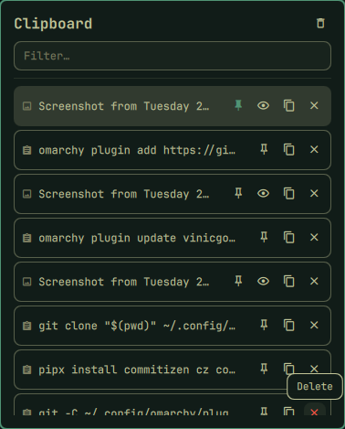

# omarchy-plugin-clipboard

A clipboard manager bar icon and popup for the
[Omarchy](https://omarchy.org/) shell, cloned from the built-in
`omarchy.clipboard` and given a bar widget of its own — same popup
style as the other bar icons (power menu, network, ...) instead of a
full-screen overlay.

## What it does

- Bar icon with a dropdown popup: recent text and image copies, a
  filter field, paste on click, and inline pin/copy/delete actions per
  row.
- Pin an entry to keep it at the top, highlighted, and exempt from
  both the history cap and "clear history" — a pinned entry only goes
  away when you explicitly delete it.
- Image entries don't render inline in the list — a preview (eye)
  button expands the popup to show the actual image instead.
- Watches the Wayland clipboard in the background (`wl-paste --watch`)
  and records every copy to
  `$XDG_STATE_HOME/omarchy/clipboard-history.json`, shared with the
  built-in plugin.

## Preview



## Usage

Click the clipboard icon in the bar to open the popup. Click a row to
paste it, or use the pin/copy/delete buttons on the right; click the
eye button on an image row to preview it before pasting.

## Install

```bash
omarchy plugin add https://github.com/vinicgobbi/omarchy-plugin-clipboard.git --enable
```

Disable the built-in `omarchy.clipboard` overlay to avoid duplicate
clipboard watchers.

## Update

```bash
omarchy plugin update vinicgobbi.clipboard
```

## Uninstall

```bash
omarchy plugin remove vinicgobbi.clipboard
```

## Notes

- Pinning is specific to this plugin — if you switch back to the
  built-in `omarchy.clipboard`, the "pinned" flag is silently dropped
  from entries the next time it rewrites the history file (the native
  plugin doesn't know about it). The entries themselves are unaffected.

## Contributing

See [CONTRIBUTING.md](CONTRIBUTING.md) for local setup, the plugin's
file structure, and the commit/release process.

## License

[MIT](LICENSE)
